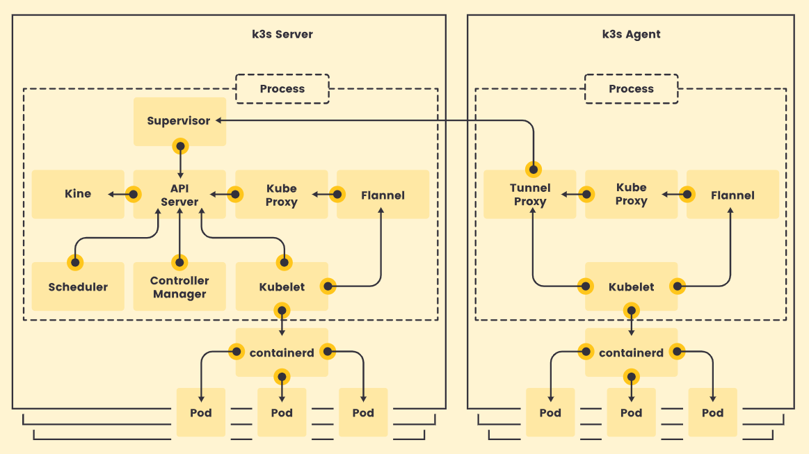
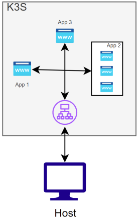

# Inception-of-Things

## Project Overview
> Inception-of-Things is a post-CC 42 project that aims to introduce you to get started in Kubernetes. It's a way to learn how to set up a personal virtual machine with Vagrant, to discover how K3s works and how a Continuous Deployment can be set with ArgoCd. 

-> add a tree picture

### 💻 Part 1 - K3s and Vagrant
This first step is an Introduction to K3s and Vagrant with a two nodes clutser: A Server machine `antauberS` and a Worker `antauberSW`.
We follow this basic architecture defined in the K3s Documentation:

*The basic K3s Architecture*

We chose `ubuntu/bionic64` for both of the machines (after several tests it was the faster and lighter LST we found) and VirtualBox as a VM Provider (easiest choice because we used it before on several projects).

We provision our VM with two differents scripts:
- A `server.sh`: launching K3s (with the defined IP address), creating a access token and update the `/etc/update-motd.d/` for a personalized welcome message.
- A `worker.sh`: launching K3s as a worker node with the server token and the correct IP address.

#### How to test it
We can test our machine with a `vagrant ssh` connection and a `kubectl get nodes -o wide` command to list our components on the Server one and `sudo systemctl status kubelet` on the worker one.

---
### ☸️ Part 2 - k3s and three simple applications
This second step is a simple K3s architecture with 3 differents applications (assigned to differents HOST, and set to the `app3.com` by default).

  
   
  <em>Simple diagram of the Part2 Architecture</em>

We choose the same OS release for efficient reasons. We add a K3s cluster on our VM, and apply our differents manifests. Each app has its own deployment and service manifest and the `ingress.yaml` handle the HTTP and HTTPS routes from outside the cluster to services within the cluster (Traefik Ingress by default).

We first started to used the [Hello Kubernetes application](https://github.com/paulbouwer/hello-kubernetes) but we wanted to keep control and knowledge about our work. So we decided to use the `hashicorp/http-echo` image and set env variables to print the name of the pod set by the Controller Manager.

#### How to test it
We can test our component with basic commands as `kubectl get nodes` or `kubectl get ingress`.
Our differents apps are availables to the following adresses:
- http://app1.com
- http://app2.com
- http://app3.com or http://192.168.56.110 (because it's or default app)

---
### 🐙 Part 3 - K3D and Argo CD
This third part focuses on K3D (a K3s cluster launched on a container) and Argo CD (handle Continus Deployment).

We start by install all our components (Docker, K3d, Kubectl and ArgoCD) and handle the Docker pull rate limit inside the cluster.
> 🐋 You need to `docker login` first to generate the `$HOME/.docker/config.json` file needed.

For simplicity, we decided to made a simple port-fowarding to connect ArgoCD with the API server instead of change the argo-cd as a load balancer.
After adding our [resources repository](https://github.com/aauberti/IoT-Manifest_p3.git) ArgoCD will automatically apply our deployment and service manifest and look at the changes every 3 minutes (with the `--sync-policy automated`).

#### How to test it
We can check the component defined in the `argocd` and `dev` namespaces with `kubectl get pods -n <namespace>`.
After we made a port-forwarding with `kubectl port-forward deployment/wil -n dev 8888:8888` we can access our app at `http://localhost:8888`.
If we try modify our image version on our manifets, we can connect to ArgoCd (`https://localhost:8080`) with `admin:Qwert12345` and saw our app is synch.

---
### 🦊 Bonus Part - K3s and Gitlab
This Bonus part is dedicated to create our own GitLab local server and sync ArgoCD to this new server instead of the original github repository.

For convenience we choose to use Helm as a GitLab package manager. Its charts are simple, but the main default is the number of pods created by Helm. It's a small student project and most of the pods created by Helm are unused here... Our `gitlab-values.yaml` defined default and minimal values to our server to be faster as possible (🏁 **Record is about 4min20s**).

#### How to test it
We can check the components defined in the `argocd`, `dev` and `gitlab` namespaces with `kubectl get pods -n <namespace>`.
The test manipulation is identical to the part3, we need to connect to the `http://gitlab.k3d.local:8181` address with `admin:<gitlab-password.txt>` (the password is generated and stocked on the file at the root repository).

---
## 📚 Sources
- [Vagrant official documentation](https://developer.hashicorp.com/vagrant/docs)
- [K3s official documentation](https://k3s.io/)
- [K3d official documentation](https://k3d.io/stable/)
- [Argo CD official documentation](https://argo-cd.readthedocs.io/en/stable/)
- [Kubectl official documentation](https://kubernetes.io/fr/docs/tasks/tools/install-kubectl/)
- [GitLab/Helm Chart official documentation](https://docs.gitlab.com/charts/)
- A very complete french blog about DevOps Stacks made by [Stephan Robert](https://blog.stephane-robert.info/)
- reddit source to main/master error

## 👥 Credits
- [aauberti](https://github.com/aauberti)
- [antauber](https://github.com/Monsieur-Bert)

📍[42 Angouleme - November 25]
